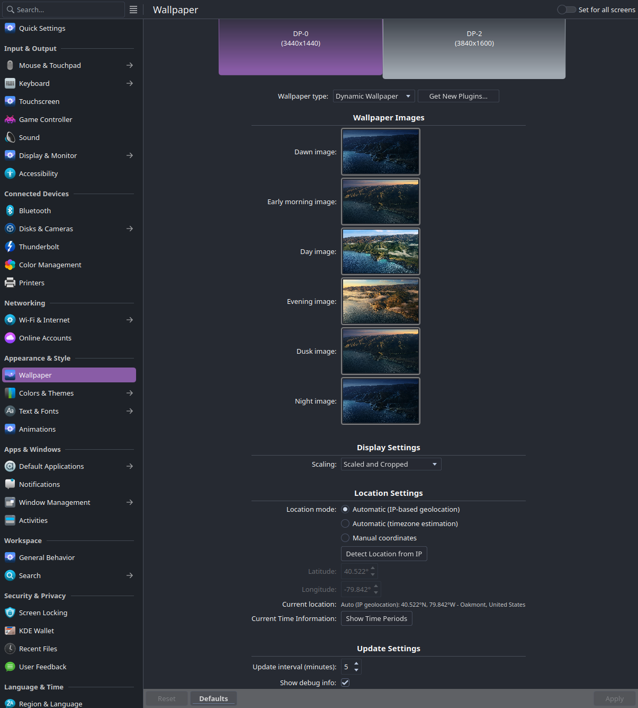

# KDE6 Dynamic Wallpaper Extension

A KDE Plasma wallpaper plugin that automatically changes your wallpaper based on the time of day using precise astronomical calculations.

## Features

- **Astronomical Time Calculation**: Uses civil and astronomical twilight times for accurate transitions
- **6 Time Periods**: Dawn, Early Morning, Day, Evening, Dusk, Night
- **Location-Aware**: Automatic location detection or manual coordinates
- **Customizable Images**: Set different wallpapers for each time period
- **Flexible Scaling**: 5 image scaling modes (cropped, scaled, fit, centered, tiled)
- **Smooth Transitions**: Automatic updates with configurable intervals
- **Debug Mode**: Optional overlay showing current time and active image

## Screenshots



*Configuration interface showing location detection options, image settings, and display modes*

## Time Periods

The extension divides the day into 6 distinct periods:

1. **Dawn** (Astronomical → Civil Twilight Sunrise)
2. **Early Morning** (Civil Twilight → 2 hours after sunrise)
3. **Day** (2 hours after sunrise → 1 hour before sunset)
4. **Evening** (1 hour before sunset → Civil Twilight Sunset)
5. **Dusk** (Civil Twilight → Astronomical Twilight Sunset)
6. **Night** (Astronomical Twilight Sunset → 2 AM)

## Quick Start

### Development Installation

```bash
git clone <repository-url>
cd kde6-dynamic-wallpaper
./dev-helper.sh install
```

### System Installation

```bash
./dev-helper.sh system
```

## Development Helper

The `dev-helper.sh` script provides all development and installation functions:

```bash
./dev-helper.sh install     # Install to user directory for development
./dev-helper.sh test        # Install and open wallpaper settings
./dev-helper.sh test-package # Test production package in user directory
./dev-helper.sh logs        # Show wallpaper logs in real-time
./dev-helper.sh restart     # Restart Plasma shell
./dev-helper.sh clean       # Clean user installations
./dev-helper.sh uninstall   # Remove user installation
./dev-helper.sh package     # Create distribution package
./dev-helper.sh release     # Create GitHub release with current version
./dev-helper.sh help        # Show help message
```

## Prerequisites

Install KDE development packages (optional, only needed for advanced development):

```bash
# Ubuntu/Debian
sudo apt install kde-dev-scripts qt6-base qt6-declarative plasma-framework-dev

# Arch Linux
sudo pacman -S kde-dev-scripts qt6-base qt6-declarative plasma-framework

# Fedora
sudo dnf install kde-dev-scripts qt6-qtbase-devel qt6-qtdeclarative-devel plasma-devel
```

**Note**: This wallpaper plugin is pure QML/JavaScript and requires no compilation. The above packages are only needed for advanced KDE development work.

## Configuration

### Location Settings

- **Automatic Detection**: Automatically detects location from timezone (default)
- **Manual Coordinates**: Set precise latitude/longitude for accurate twilight calculations

### Image Configuration

Configure custom wallpapers for each time period:

- Dawn image
- Early morning image
- Day image
- Evening image
- Dusk image
- Night image

### Display Settings

Choose from 5 scaling modes:

- **Scaled and Cropped**: Maintains aspect ratio, fills screen (may crop)
- **Scaled**: Stretches to fill screen (may distort)
- **Scaled, Keep Proportions**: Maintains aspect ratio with black bars if needed
- **Centered**: Shows image at original size, centered
- **Tiled**: Repeats image to fill screen

### Update Settings

- **Update Interval**: How often to check for time changes (1-60 minutes)
- **Debug Mode**: Show time and image information overlay

## Development

### Development Workflow

```bash
# Install for development
./dev-helper.sh install

# Show logs while testing
./dev-helper.sh logs

# Make changes to code...

# Reinstall and restart plasma
./dev-helper.sh install
./dev-helper.sh restart
```

### Testing

```bash
# Quick test - installs and opens settings
./dev-helper.sh test

# Manual testing
./dev-helper.sh install
# Open System Settings > Appearance > Wallpaper
# Select 'Dynamic Wallpaper' and configure
```

## Distribution

### Creating Release Package

```bash
./dev-helper.sh package
```

This creates a `.tar.xz` file ready for upload to [KDE Store](https://store.kde.org/).

### Creating GitHub Release

```bash
./dev-helper.sh release
```

This creates a GitHub release with the current version, uploads the package, and creates a git tag.

### Installation Methods

#### Method 1: KDE Store (Recommended)
1. Open System Settings > Appearance > Wallpaper
2. Click "Get New Wallpapers..."
3. Search for "Dynamic Wallpaper"
4. Click "Install"

#### Method 2: Manual Download & Install
If the KDE Store installation fails, you can install manually:

1. Download the latest `.tar.xz` file from:
   - [GitHub Releases](https://github.com/mmoyles87/kde-dynamic-wallpaper/releases)
   - [KDE Store](https://store.kde.org/)

2. Install using command line:
   ```bash
   kpackagetool6 --type Plasma/Wallpaper --install kde6-dynamic-wallpaper-1.0.1.tar.xz
   ```

3. Or install manually:
   ```bash
   # Extract the package
   tar -xf kde6-dynamic-wallpaper-1.0.1.tar.xz
   
   # Copy to wallpaper directory
   mkdir -p ~/.local/share/plasma/wallpapers/org.kde.plasma.dynamicwallpaper
   cp -r * ~/.local/share/plasma/wallpapers/org.kde.plasma.dynamicwallpaper/
   
   # Restart Plasma
   kquitapp6 plasmashell && kstart plasmashell
   ```

#### Method 3: Development Installation
```bash
git clone https://github.com/mmoyles87/kde-dynamic-wallpaper.git
cd kde6-dynamic-wallpaper
./dev-helper.sh install
```

### KDE Store Publishing

1. Visit [KDE Store](https://store.kde.org/)
2. Login and click "Add Product"
3. Select category: Plasma Addons > Wallpapers
4. Upload the generated `.tar.xz` file
5. Fill in description, screenshots, and metadata

## Troubleshooting

### Common Issues

1. **Plugin not appearing in wallpaper settings**

   - Run: `./dev-helper.sh restart` to restart Plasma
   - Check installation: `./dev-helper.sh install`

2. **KDE Store installation fails with "Could not read file" error**

   - Use manual installation method instead (see Installation Methods above)
   - Download directly from GitHub Releases
   - Install via command line: `kpackagetool6 --type Plasma/Wallpaper --install package.tar.xz`

3. **Images not loading**

   - Verify image paths in configuration are correct and accessible
   - Check that image files exist and are readable

4. **Time calculations seem wrong**
   - Verify latitude/longitude settings in configuration
   - Enable debug mode to see current calculations
   - Use automatic location detection for easier setup

### Development Debugging

Enable debug mode in configuration to see:

- Current time and time period
- Active image filename
- Latitude/longitude coordinates
- Fill mode and other settings

### Log Output

View real-time logs:

```bash
./dev-helper.sh logs
```

## Contributing

1. Fork the repository
2. Create a feature branch
3. Make your changes
4. Test with `./dev-helper.sh test`
5. Submit a pull request

## License

GPL-2.0+ - See LICENSE file for details

## Astronomical Calculations

The extension uses precise astronomical formulas to calculate:

- Civil twilight (sun 6° below horizon)
- Astronomical twilight (sun 18° below horizon)
- Sunrise/sunset times
- Solar noon and equation of time corrections

These calculations ensure accurate timing regardless of your location on Earth.
